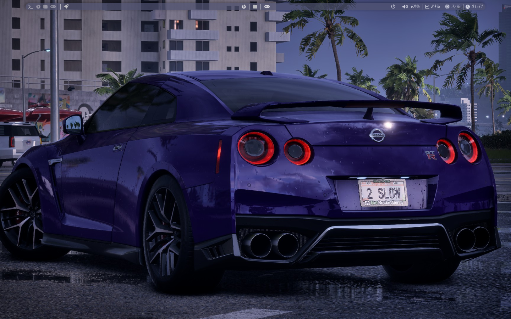
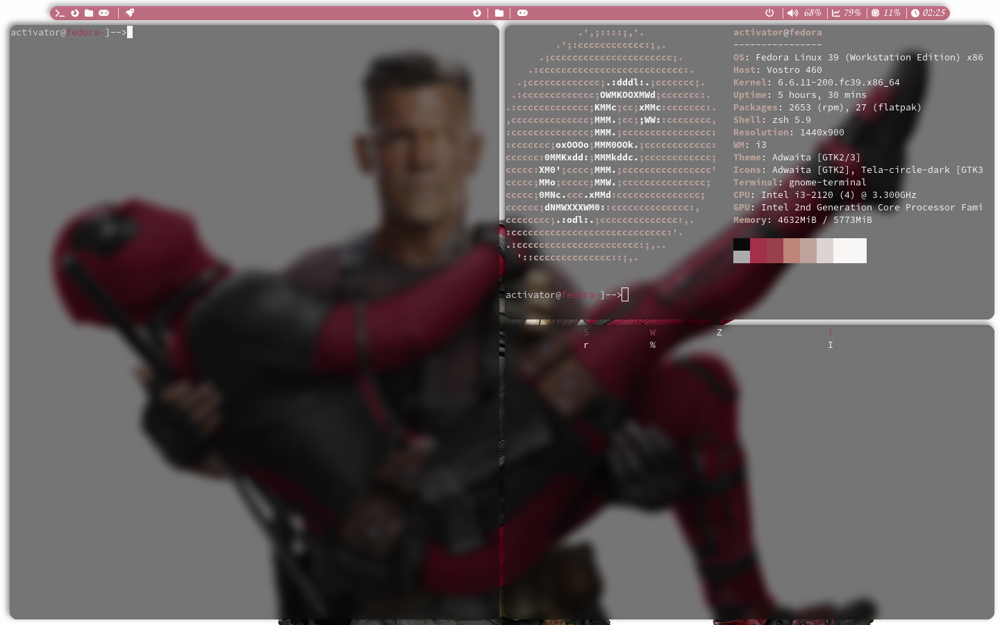
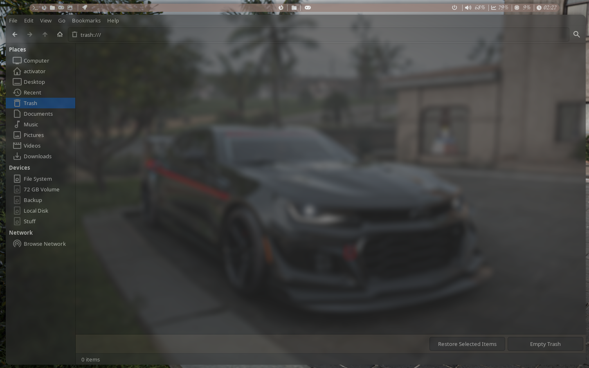
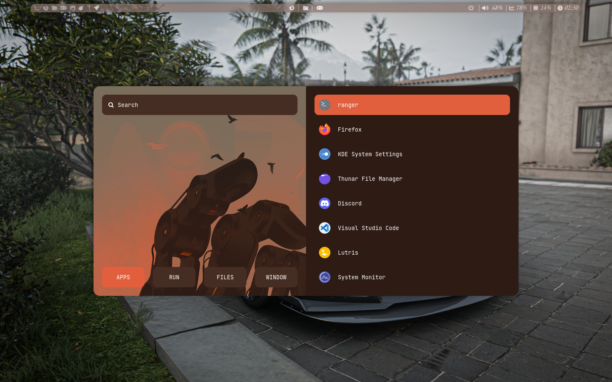
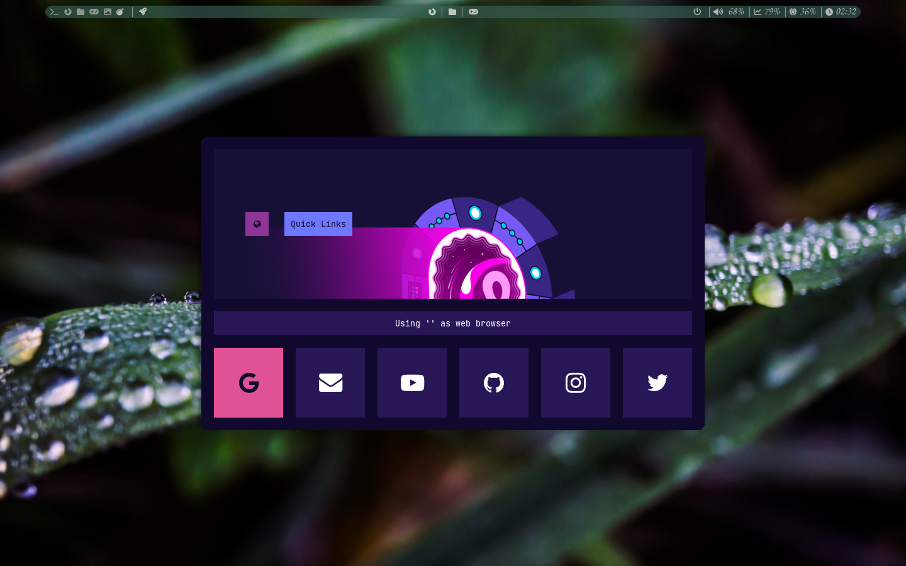
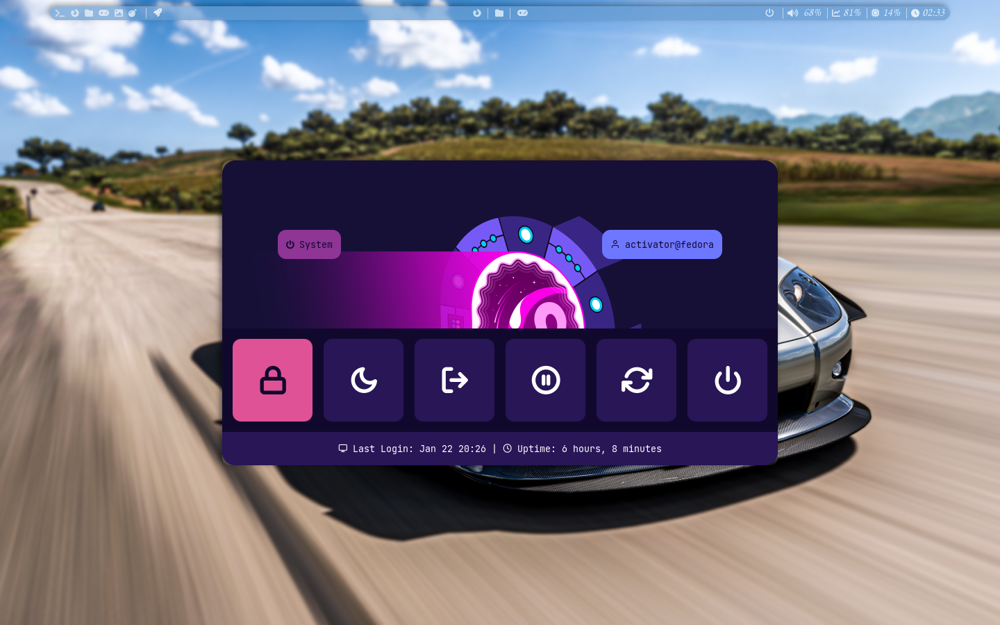
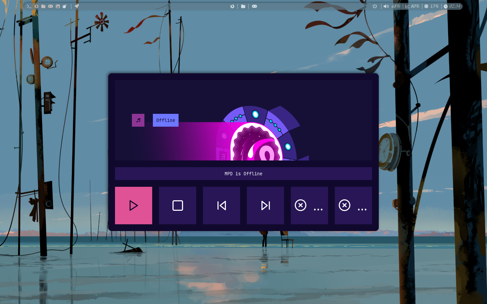
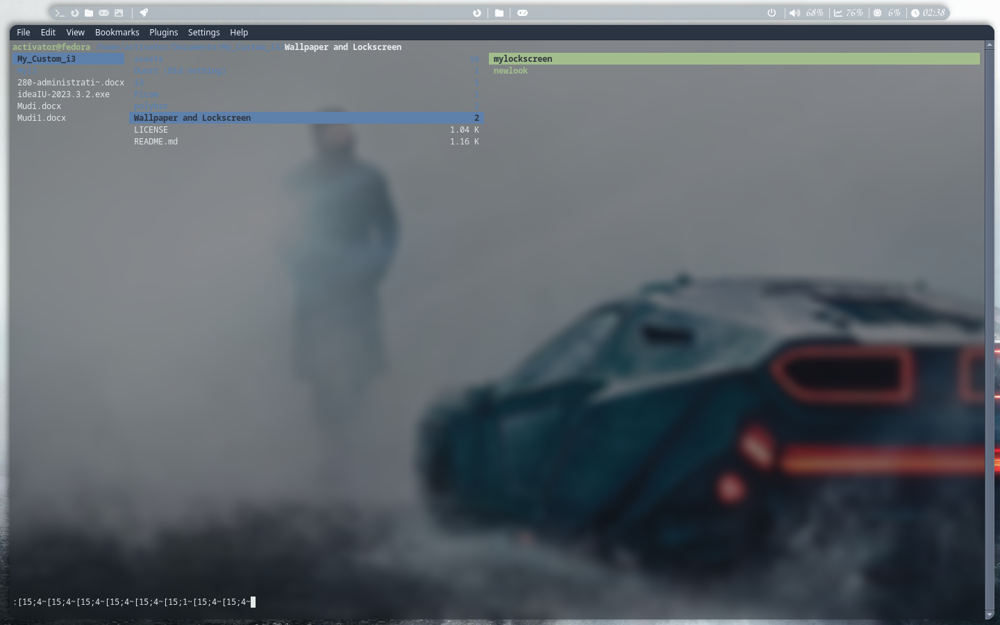

# Fedora rice using i3

Hello, this is my first rice of Fedora using i3 wm. It's pretty basic as I have no knowledge of these things but it is close to perfect for me.

## Images

## Gnome Terminal

## Thunar

## Rofi

## Ranger

## What I've done

In these configuration files you will find:
 i3 config.
 My Random Wallpaper Generator and color generator using pywal.
 My Random Lock-screen Wallpaper Generator and Lock-screen launcher.
 Polybar Config with the Background Color from the Wallpaper.
 My Picom Config.
 Dunst config.
 Rofi is not provided (done by https://github.com/adi1090x/rofi).

## What I am Working On
Anything I could think of:
 Might configure Dunst a bit more.
 Spotify Themes would be nice.
 

For me this rice is perfect as it changes the whole theme of polybar and color scheme using pywal. The only thing I would try is to theme the apps.

## Wallpapers
Wallpapers are taken from: https://wallhaven.cc/
