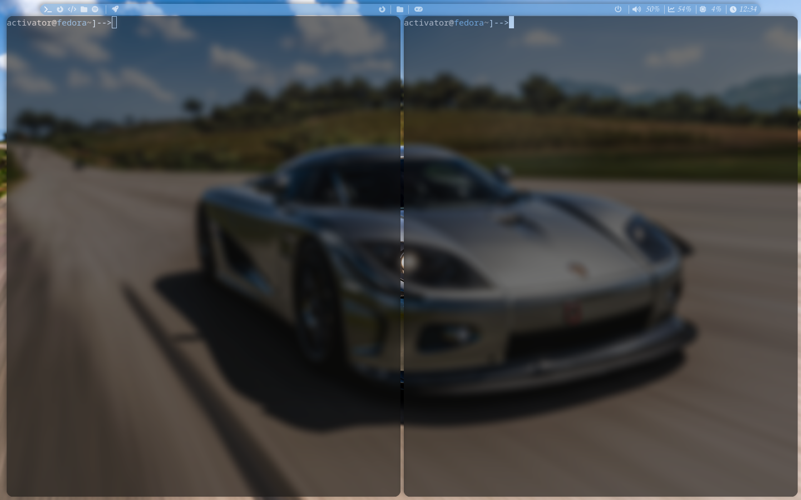
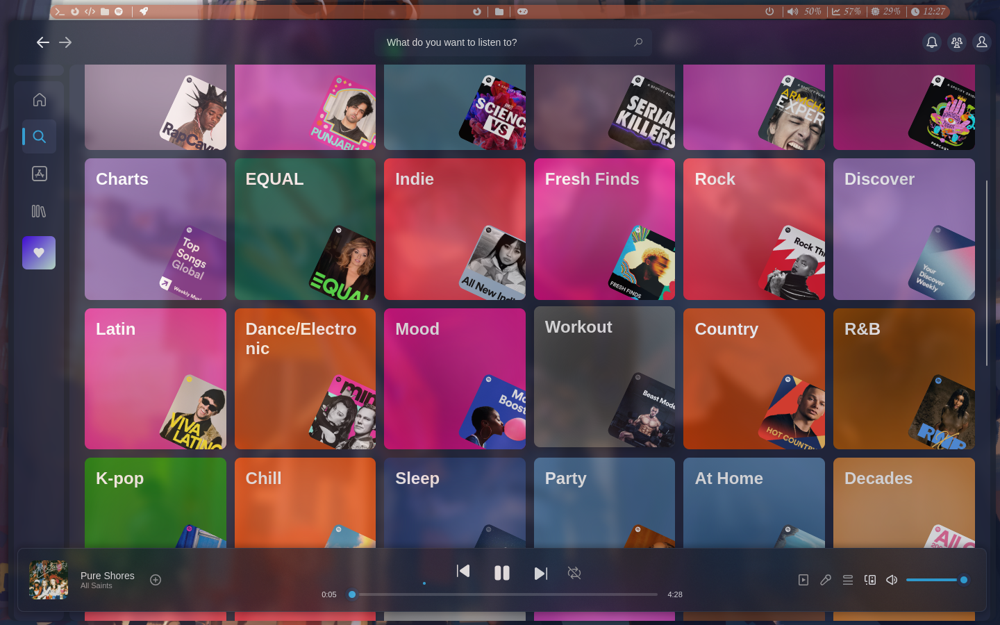
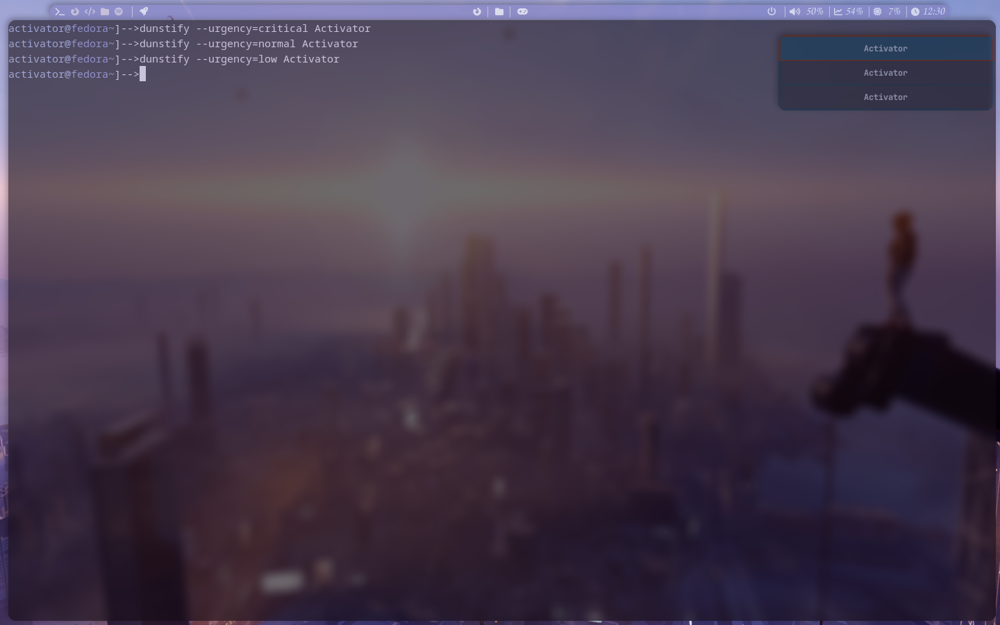

# i3wm rice on Fedora

Hello, this is my first rice of Fedora using i3 wm. It's pretty basic as I have no knowledge of these things but it is close to perfect for me.

## Images

## Gnome Terminal

## Alacritty

## Thunar

## Ranger

## Spotify

## Rofi

## Dunst

## What I've done

##### In these configuration files you will find:
 1. i3 config.
 2. My Random Wallpaper Generator.
 3. Color generator using pywal.
 4. My Random Lock-screen Wallpaper Generator and Lock-screen launcher.
 5. Polybar Config with the Background Color from the Wallpaper.
 6. My Picom Config.
 7. Dunst config.
 8. Rofi is not provided (done by https://github.com/adi1090x/rofi).

## What I am Working On
Anything I could think of:

 Your Recommendations will be appreciated
 

For me this rice is perfect as it changes the whole theme of polybar and color scheme using pywal. The only thing I would try is to theme the apps.

## Wallpapers
Wallpapers are taken from: https://wallhaven.cc/
